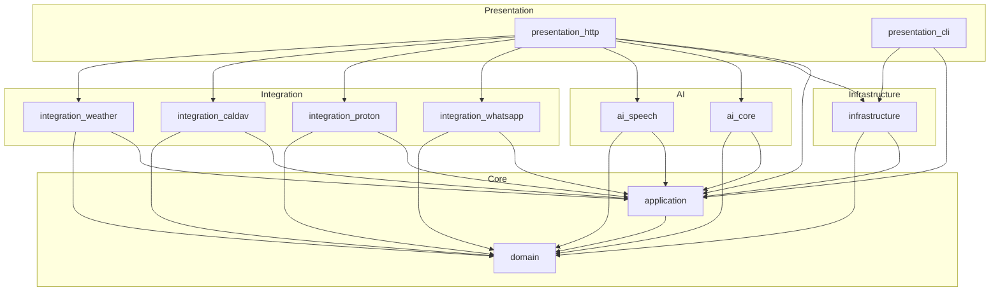

# Architecture

> 🏗️ System design and architectural patterns in PiSovereign

This document explains the architectural decisions, design patterns, and structure of PiSovereign.

## Table of Contents

- [Overview](#overview)
- [Clean Architecture](#clean-architecture)
  - [Layer Responsibilities](#layer-responsibilities)
  - [Dependency Rule](#dependency-rule)
- [Crate Dependencies](#crate-dependencies)
  - [Dependency Graph](#dependency-graph)
  - [Workspace Structure](#workspace-structure)
- [Port/Adapter Pattern](#portadapter-pattern)
  - [Ports (Interfaces)](#ports-interfaces)
  - [Adapters (Implementations)](#adapters-implementations)
  - [Example: Secret Store](#example-secret-store)
- [Data Flow](#data-flow)
- [Key Design Decisions](#key-design-decisions)

---

## Overview

PiSovereign follows **Clean Architecture** (also known as Hexagonal Architecture or Ports & Adapters) to achieve:

- **Independence from frameworks** - Business logic doesn't depend on Axum, SQLite, or any external library
- **Testability** - Core logic can be tested without infrastructure
- **Flexibility** - Adapters can be swapped without changing business rules
- **Maintainability** - Clear boundaries between concerns

```
┌─────────────────────────────────────────────────────────────────┐
│                     External World                               │
│  (HTTP Clients, WhatsApp, Email Servers, AI Hardware)           │
└─────────────────────────────────────────────────────────────────┘
                              │
                              ▼
┌─────────────────────────────────────────────────────────────────┐
│                   Presentation Layer                             │
│  ┌─────────────────┐          ┌─────────────────┐              │
│  │ presentation_   │          │ presentation_   │              │
│  │     http        │          │     cli         │              │
│  │  (Axum API)     │          │  (Clap CLI)     │              │
│  └─────────────────┘          └─────────────────┘              │
└─────────────────────────────────────────────────────────────────┘
                              │
                              ▼
┌─────────────────────────────────────────────────────────────────┐
│                   Application Layer                              │
│  ┌─────────────────────────────────────────────────────────┐   │
│  │                    application                            │   │
│  │  (Services, Use Cases, Orchestration, Port Definitions)  │   │
│  └─────────────────────────────────────────────────────────┘   │
└─────────────────────────────────────────────────────────────────┘
                              │
              ┌───────────────┼───────────────┐
              ▼               ▼               ▼
┌──────────────────┐ ┌──────────────┐ ┌──────────────────────────┐
│   Domain Layer   │ │  AI Layer    │ │   Infrastructure Layer   │
│  ┌────────────┐  │ │ ┌──────────┐ │ │ ┌──────────────────────┐ │
│  │   domain   │  │ │ │ ai_core  │ │ │ │    infrastructure    │ │
│  │ (Entities, │  │ │ │(Inference│ │ │ │  (Adapters, Repos,   │ │
│  │  Values,   │  │ │ │ Engine)  │ │ │ │  Cache, DB, Vault)   │ │
│  │ Commands)  │  │ │ └──────────┘ │ │ └──────────────────────┘ │
│  └────────────┘  │ │ ┌──────────┐ │ │                          │
│                  │ │ │ai_speech │ │ │  ┌──────────────────┐   │
│                  │ │ │(STT/TTS) │ │ │  │  integration_*   │   │
│                  │ │ └──────────┘ │ │  │ (WhatsApp, Mail, │   │
│                  │ │              │ │  │  Calendar, etc.) │   │
│                  │ └──────────────┘ │  └──────────────────┘   │
└──────────────────┘                  └──────────────────────────┘
```

---

## Clean Architecture

### Layer Responsibilities

| Layer | Crates | Responsibility |
|-------|--------|----------------|
| **Domain** | `domain` | Core business entities, value objects, commands, domain errors |
| **Application** | `application` | Use cases, service orchestration, port definitions |
| **Infrastructure** | `infrastructure`, `integration_*` | Adapters for external systems (DB, cache, APIs) |
| **AI** | `ai_core`, `ai_speech` | AI-specific logic (inference, speech processing) |
| **Presentation** | `presentation_http`, `presentation_cli` | User interfaces (REST API, CLI) |

### Dependency Rule

> **Inner layers NEVER depend on outer layers**

```
domain          → (no dependencies on other PiSovereign crates)
application     → domain
ai_core         → domain, application (ports)
ai_speech       → domain, application (ports)
infrastructure  → domain, application (ports)
integration_*   → domain, application (ports)
presentation_*  → domain, application, infrastructure, ai_*, integration_*
```

This means:
- `domain` knows nothing about databases, HTTP, or external services
- `application` defines what it needs via ports (traits), not how it's done
- Only `presentation` crates wire everything together

---

## Crate Dependencies

### Dependency Graph



### Workspace Structure

```
PiSovereign/
├── Cargo.toml              # Workspace manifest
├── crates/
│   ├── domain/             # Core business logic (no external deps)
│   │   ├── Cargo.toml
│   │   └── src/
│   │       ├── lib.rs
│   │       ├── entities/   # User, Conversation, Message, etc.
│   │       ├── values/     # UserId, MessageContent, etc.
│   │       ├── commands/   # UserCommand, SystemCommand
│   │       └── errors.rs   # Domain errors
│   │
│   ├── application/        # Use cases and ports
│   │   ├── Cargo.toml
│   │   └── src/
│   │       ├── lib.rs
│   │       ├── services/   # ConversationService, CommandService, etc.
│   │       └── ports/      # Trait definitions (InferencePort, etc.)
│   │
│   ├── infrastructure/     # Framework-dependent implementations
│   │   ├── Cargo.toml
│   │   └── src/
│   │       ├── lib.rs
│   │       ├── adapters/   # VaultSecretStore, etc.
│   │       ├── cache/      # MokaCache, RedbCache
│   │       ├── persistence/# SQLite repositories
│   │       └── telemetry/  # OpenTelemetry setup
│   │
│   ├── ai_core/            # Inference engine
│   │   └── src/
│   │       ├── hailo/      # Hailo-Ollama client
│   │       └── selector/   # Model routing
│   │
│   ├── ai_speech/          # Speech processing
│   │   └── src/
│   │       ├── providers/  # Hybrid, Local, OpenAI
│   │       └── converter/  # Audio format conversion
│   │
│   ├── integration_*/      # External service adapters
│   │
│   └── presentation_*/     # User interfaces
```

---

## Port/Adapter Pattern

### Ports (Interfaces)

Ports are **traits** defined in `application/src/ports/` that describe what the application needs:

```rust
// application/src/ports/inference.rs
#[async_trait]
pub trait InferencePort: Send + Sync {
    async fn generate(
        &self,
        prompt: &str,
        options: InferenceOptions,
    ) -> Result<InferenceResponse, InferenceError>;
    
    async fn generate_stream(
        &self,
        prompt: &str,
        options: InferenceOptions,
    ) -> Result<impl Stream<Item = Result<String, InferenceError>>, InferenceError>;
    
    async fn health_check(&self) -> Result<bool, InferenceError>;
}
```

```rust
// application/src/ports/secret_store.rs
#[async_trait]
pub trait SecretStore: Send + Sync {
    async fn get_secret(&self, path: &str) -> Result<Option<String>, SecretError>;
    async fn health_check(&self) -> Result<bool, SecretError>;
}
```

### Adapters (Implementations)

Adapters **implement ports** and live in `infrastructure/` or `integration_*/`:

```rust
// infrastructure/src/adapters/vault_secret_store.rs
pub struct VaultSecretStore {
    client: VaultClient,
    mount_path: String,
}

#[async_trait]
impl SecretStore for VaultSecretStore {
    async fn get_secret(&self, path: &str) -> Result<Option<String>, SecretError> {
        let full_path = format!("{}/{}", self.mount_path, path);
        self.client.read_secret(&full_path).await
    }
    
    async fn health_check(&self) -> Result<bool, SecretError> {
        self.client.health().await
    }
}
```

```rust
// infrastructure/src/adapters/env_secret_store.rs
pub struct EnvironmentSecretStore {
    prefix: Option<String>,
}

#[async_trait]
impl SecretStore for EnvironmentSecretStore {
    async fn get_secret(&self, path: &str) -> Result<Option<String>, SecretError> {
        // Convert "database/password" to "DATABASE_PASSWORD"
        let env_key = self.path_to_env_var(path);
        Ok(std::env::var(&env_key).ok())
    }
    
    async fn health_check(&self) -> Result<bool, SecretError> {
        Ok(true) // Environment is always available
    }
}
```

### Example: Secret Store

The `ChainedSecretStore` demonstrates the adapter pattern:

```rust
// infrastructure/src/adapters/chained_secret_store.rs
pub struct ChainedSecretStore {
    stores: Vec<Box<dyn SecretStore>>,
}

impl ChainedSecretStore {
    pub fn new() -> Self {
        Self { stores: Vec::new() }
    }
    
    pub fn add_store(mut self, store: impl SecretStore + 'static) -> Self {
        self.stores.push(Box::new(store));
        self
    }
}

#[async_trait]
impl SecretStore for ChainedSecretStore {
    async fn get_secret(&self, path: &str) -> Result<Option<String>, SecretError> {
        for store in &self.stores {
            if let Ok(Some(secret)) = store.get_secret(path).await {
                return Ok(Some(secret));
            }
        }
        Ok(None)
    }
}
```

**Usage in application:**

```rust
// Wiring in presentation layer
let secret_store = ChainedSecretStore::new()
    .add_store(VaultSecretStore::new(vault_config)?)
    .add_store(EnvironmentSecretStore::new(Some("PISOVEREIGN")));

let command_service = CommandService::new(
    Arc::new(secret_store),  // Injected as trait object
    // ... other dependencies
);
```

---

## Data Flow

### Example: Chat Request

```
1. HTTP Request arrives at /v1/chat
   │
   ▼
2. presentation_http extracts request, validates auth
   │
   ▼
3. Calls ConversationService.send_message() [application layer]
   │
   ▼
4. ConversationService:
   ├── Loads conversation from ConversationRepository [port]
   ├── Calls InferencePort.generate() [port]
   └── Saves message via ConversationRepository [port]
   │
   ▼
5. InferencePort implementation (ai_core::HailoClient):
   ├── Sends request to Hailo-Ollama
   └── Returns response
   │
   ▼
6. Response flows back through layers
   │
   ▼
7. HTTP Response returned to client
```

### Example: WhatsApp Voice Message

```
1. WhatsApp Webhook POST to /v1/webhooks/whatsapp
   │
   ▼
2. integration_whatsapp validates signature, parses message
   │
   ▼
3. VoiceMessageService.process() [application layer]
   │
   ├── Download audio via WhatsAppPort
   ├── Convert format via AudioConverter [ai_speech]
   ├── Transcribe via SpeechPort (STT)
   ├── Process text via CommandService
   ├── (Optional) Synthesize via SpeechPort (TTS)
   └── Send response via WhatsAppPort
   │
   ▼
4. Response sent back to user via WhatsApp
```

---

## Key Design Decisions

### 1. Async-First

All I/O operations are async using Tokio:

```rust
#[async_trait]
pub trait InferencePort: Send + Sync {
    async fn generate(&self, ...) -> Result<..., ...>;
}
```

**Rationale**: Maximizes throughput on limited Raspberry Pi resources.

### 2. Error Handling via `thiserror`

Each layer defines its own error types:

```rust
// domain/src/errors.rs
#[derive(Debug, thiserror::Error)]
pub enum DomainError {
    #[error("Invalid message content: {0}")]
    InvalidContent(String),
}

// application/src/errors.rs
#[derive(Debug, thiserror::Error)]
pub enum ServiceError {
    #[error("Domain error: {0}")]
    Domain(#[from] DomainError),
    #[error("Inference failed: {0}")]
    Inference(String),
}
```

**Rationale**: Clear error boundaries, easy conversion between layers.

### 3. Feature Flags

Optional features reduce binary size:

```toml
# Cargo.toml
[features]
default = ["http"]
http = ["axum", "tower", ...]
cli = ["clap", ...]
speech = ["whisper", "piper", ...]
```

**Rationale**: Raspberry Pi has limited storage; include only what's needed.

### 4. Configuration via `config` Crate

Layered configuration (defaults → file → env vars):

```rust
let config = Config::builder()
    .add_source(config::File::with_name("config"))
    .add_source(config::Environment::with_prefix("PISOVEREIGN"))
    .build()?;
```

**Rationale**: Flexibility for different deployment scenarios.

### 5. Multi-Layer Caching

```
Request → L1 (Moka, in-memory) → L2 (Redb, persistent) → Backend
```

**Rationale**: Minimize latency and reduce load on inference engine.

---

## Further Reading

- [Crate Reference](./crate-reference.md) - Detailed documentation of each crate
- [API Reference](./api-reference.md) - REST API documentation
- [Contributing](./contributing.md) - How to contribute
